  <picture>
    <source media="(prefers-color-scheme: dark)" srcset="./assets/profile-dark.svg" />
    
  </picture>

<!-- Interactive Clickable Connect Cards -->

  <a href="https://github.com/ByteLounge" target="_blank" rel="noopener noreferrer">
    <picture>
      <source media="(prefers-color-scheme: dark)" srcset="./assets/cards/github-dark.svg" />
      
    </picture>
  </a>
  <a href="https://www.linkedin.com/in/yashsanikop" target="_blank" rel="noopener noreferrer">
    <picture>
      <source media="(prefers-color-scheme: dark)" srcset="./assets/cards/linkedin-dark.svg" />
      
    </picture>
  </a>
  <a href="https://yashsanikop.netlify.app/" target="_blank" rel="noopener noreferrer">
    <picture>
      <source media="(prefers-color-scheme: dark)" srcset="./assets/cards/portfolio-dark.svg" />
      
    </picture>
  </a>
  <a href="https://discord.gg/wfhKzMMTCw" target="_blank" rel="noopener noreferrer">
    <picture>
      <source media="(prefers-color-scheme: dark)" srcset="./assets/cards/discord-dark.svg" />
      
    </picture>
  </a>

  <a href="https://x.com/SanikopYas30163" target="_blank" rel="noopener noreferrer">
    <picture>
      <source media="(prefers-color-scheme: dark)" srcset="./assets/cards/twitter-dark.svg" />
      
    </picture>
  </a>
  <a href="https://www.hackerrank.com/profile/konuriyash" target="_blank" rel="noopener noreferrer">
    <picture>
      <source media="(prefers-color-scheme: dark)" srcset="./assets/cards/hackerrank-dark.svg" />
      
    </picture>
  </a>
  <a href="https://www.instagram.com/sanikopyash" target="_blank" rel="noopener noreferrer">
    <picture>
      <source media="(prefers-color-scheme: dark)" srcset="./assets/cards/instagram-dark.svg" />
      
    </picture>
  </a>
  <a href="mailto:sanikopyash1@gmail.com">
    <picture>
      <source media="(prefers-color-scheme: dark)" srcset="./assets/cards/gmail-dark.svg" />
      
    </picture>
  </a>

  ✨ Updated daily via GitHub Actions

